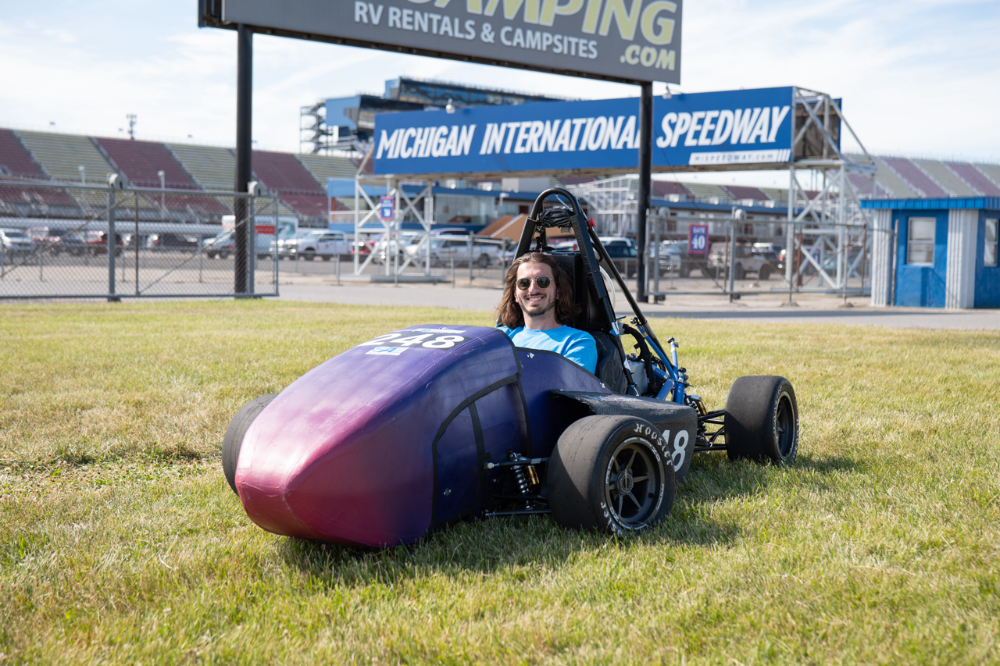
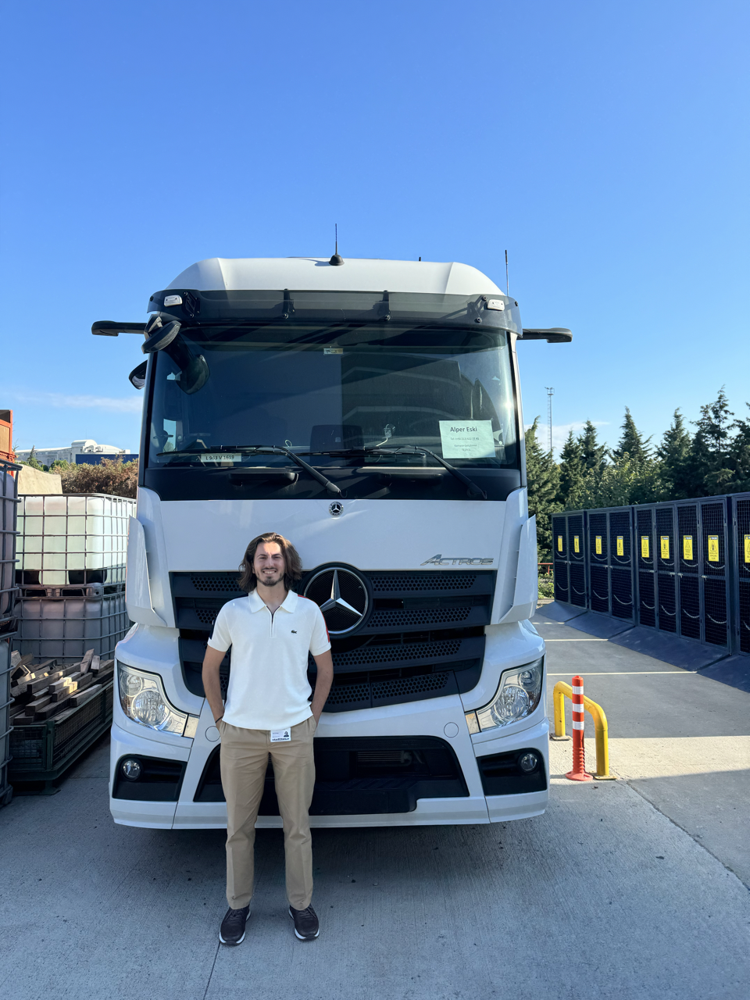
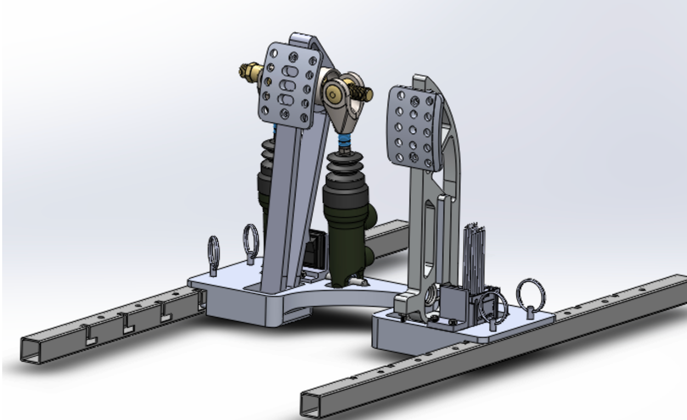
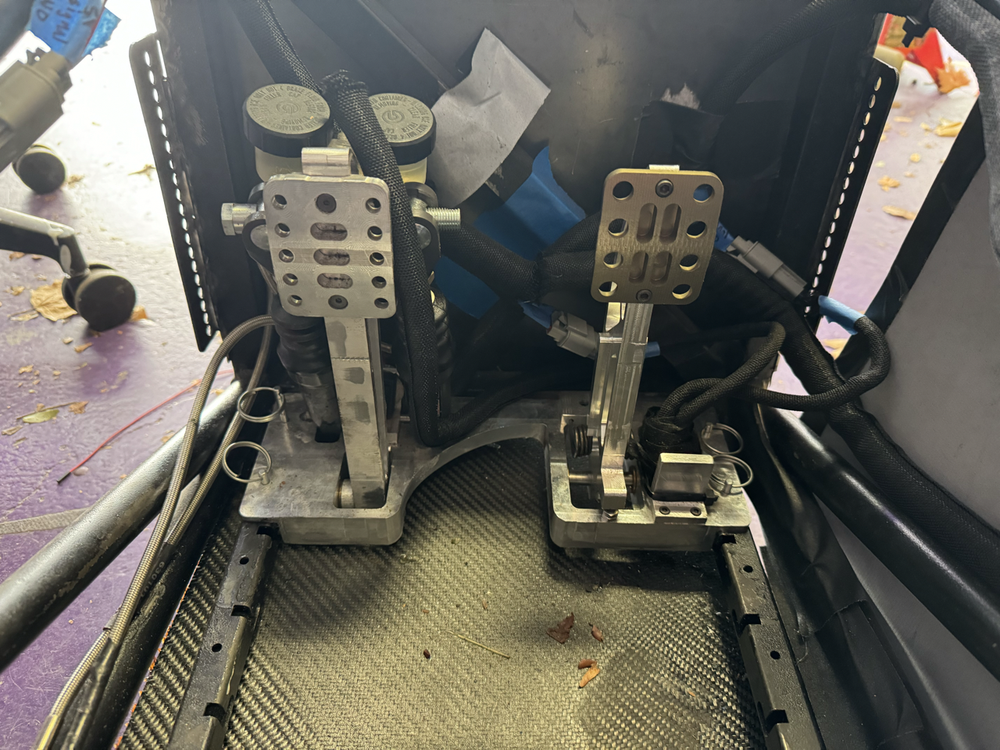
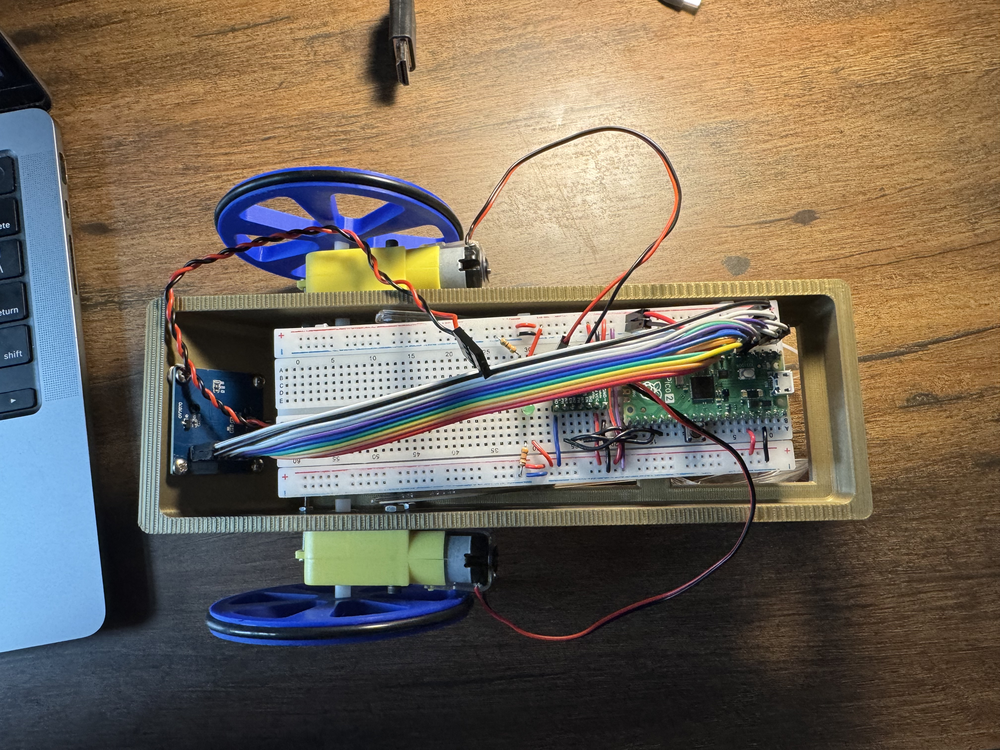
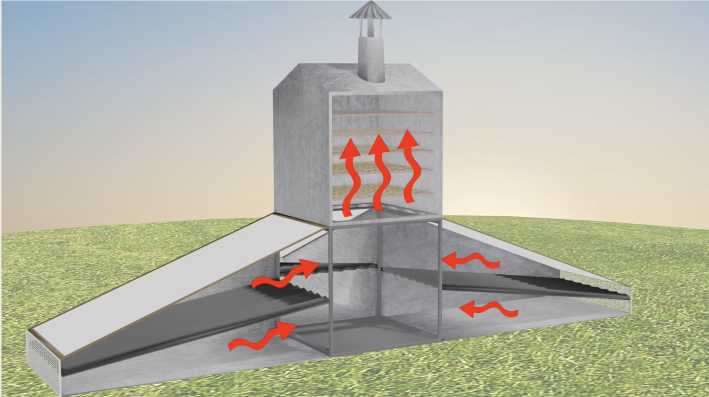
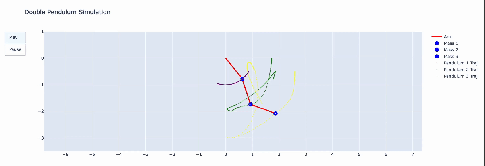
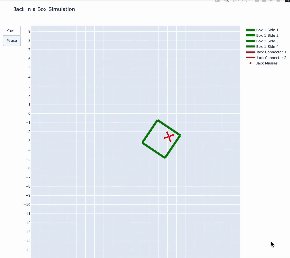
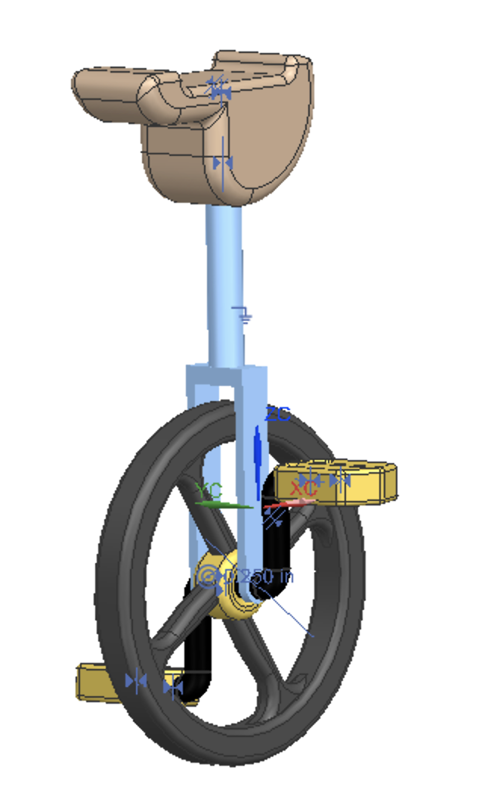

# Daniel Kıllıoğlu  
🚀 *Mechanical Engineering Senior | Product Design & Mechatronics Enthusiast | Music Technologist*  
📍 Chicago, USA & Istanbul, Turkey  

---

## 🌟 Featured Highlights  

<table>
  <tr>
    <td align="center" width="200">
       
      🧪 Built AKBA’s first benchtop dilution system and standardized product lines
    </td>
    <td align="center" width="200">
       
      🚛 Reduced stress by 40% & cut costs by 21% with new part designs
    </td>
    <td align="center" width="200">
       
      🏎️ Designed & manufactured hubs, pedal box, and suspension ahead of schedule
    </td>
  </tr>
  <tr>
    <td align="center" width="200">
       
      🌞 Boosted drying efficiency by 15%, airflow by 60%, in 14+ countries
    </td>
    <td align="center" width="200">
       
      🤖 Built a line-following robot with tuned PID control for racing
    </td>
    <td align="center" width="200">
       
      🌍 Collaborated across US & Europe; fluent in English/Turkish, working German
    </td>
  </tr>
</table>

---

## 👋 About Me  

I’m a **senior Mechanical Engineering student at Northwestern University** with a minor in Music Technology. My passion lies at the intersection of **product design, mechatronics, and human-centered engineering**, where I strive to create solutions that are both **functional and aesthetically impactful**.  

From designing **ergonomic consumer products** to developing **autonomous robots** and **fluid systems**, I thrive on projects that demand **creative problem solving, precision engineering, and cross-disciplinary collaboration**.  

I am currently seeking **Product Design & Mechanical Engineering internships/full-time roles for 2025**, where I can apply my skills in **CAD design, prototyping, testing, and user-centered innovation** to bring ideas to life.  
 
---

## 🎓 Education  

**Northwestern University**, Evanston, IL  
*Bachelor of Science in Mechanical Engineering* | Minor in Music Technology  
*Sep 2022 – Jun 2026 (anticipated)* | **GPA: 3.9/4.0**  

**Robert College**, Istanbul, TR  
High School Diploma | *Sep 2017 – Jun 2022*  

---

## ⚙️ Technical Skills  

- **Mechanical Design:** Siemens NX, SolidWorks, Fusion 360, AutoCAD, GD&T, P&ID, Injection Molding, Sheet Metal Forming, Casting, CNC Machining, 3D Printing, Rapid Prototyping  
- **Simulation & Analysis:** MATLAB, ANSYS, Simulink, Topology Optimization, Kinetic Simulation  
- **Programming & Electronics:** Python, C, Embedded Systems, PID Motor Control, SPI, I²C, Raspberry Pi, PIC  
- **Design Tools:** Adobe Illustrator, Figma  
- **Core Strengths:** Collaboration, Cross-Cultural Communication, Adaptability, Problem Solving  

---

## 🌍 Languages  

- 🇺🇸 **English**: Native  
- 🇹🇷 **Turkish**: Native  
- 🇩🇪 **German**: Limited Working Proficiency  

---

## 💼 Experience  

### **Engineering Intern – Asahi Kasei Bioprocess America (AKBA)**  
*Glenview, IL | Jun 2025 – Aug 2025*  
- **Designed and built AKBA’s first benchtop buffer-dilution system**, creating a fully functional prototype for testing and client demos.  
- **Standardized a pressurized-vessel product line** by aggregating critical parameters from custom projects, cutting costs and improving lead times.  
- **Improved drawings and BOMs** by correcting tolerances, refreshing legacy callouts, and clarifying hardware specs to streamline procurement and assembly.  

---

### **Mechanical Engineering Intern – Truck R&D**  
Mercedes-Benz Türk A.S. | *Jul 2024 – Oct 2024*  
- Optimized ergonomics and manufacturability of user-interacting components via kinematic simulation.  
- Reduced stress concentrations by **40%** through FEA-driven redesign of sheet-metal parts.  
- Developed a **low-cost die-cast flap system** to support next-gen electric truck charging.  
- Coordinated simulation, prototyping, and manufacturing workflows with detailed GD&T drawings.  
- Achieved **21% cost reduction** and improved operator ergonomics with injection-molded part replacements.  

  

---

### **Chassis & Suspension Design Engineer**  
[Northwestern Formula Racing](https://northwesternformularacing.com/) | *Sep 2022 – Present*  
- Designed **pedal box, wheel hubs, and steering rack** under FSAE regulations.  
- Integrated a **torsional spring + potentiometer throttle return system** for improved control and sensing.  
- Manufactured CNC and lathe parts in-house and validated through testing.  
- Delivered **lighter, more reliable designs**; reduced hub weight by **6%** and cost by **17%**.  
- Coordinated vendors and schedules, completing full suspension components **one month ahead of deadlines**.  

 |   

---

## 🚦 Project Highlights  

### **Line-Following Robot – Advanced Mechatronics (2025 Tech Cup)**  
- Built an **autonomous differential-drive robot** to complete a 40-foot white-line track.  
- Designed lightweight chassis with **laser-cut & 3D printed parts**.  
- Tuned a **PID control algorithm** with nested **current + position loops** for smooth, fast lap performance.  

 |   

---

### **Product Design Engineer**  
Segal Design Institute – DTC Program | *Sep 2022 – Jun 2023*  

**Client: Northwestern Formula Racing** – *The Ark*  
- Designed an **ergonomic, durable steering rack cover** enhancing safety & driver comfort.  

**Client: Trees That Feed Foundation** – *Aeroflect*  
- Boosted hybrid solar dryer efficiency by **15%**, with deployments in **14+ countries**.  
- Improved airflow by **60%** and increased drying temperature by **25 °F**, all at **no added cost**.  

  

---

### **System Dynamics Simulations (Python)**  
- Modeled complex systems including pendulum dynamics and jack-in-a-box motion.  

 |   

---

### **Unicycle Design Concept**  
Explored balance and dynamic stability through CAD modeling and analysis.  

  

---

## 📌 Quick Facts  

- 🛠️ Designed **consumer product concepts**, **lab fluid systems**, and **autonomous robots**.  
- 🎵 Musician, producer, and DJ with a deep passion for **audio and product design**.  
- 🌍 Experienced in **global collaboration** across U.S. and European teams.  

---

## 📫 Let’s Connect  

I’m always excited to collaborate on projects in **product design, mechatronics, and engineering innovation**.  
Reach me at [danielklloglu@gmail.com](mailto:danielklloglu@gmail.com) or on [LinkedIn](https://www.linkedin.com/in/danielkillioglu/).  

---
