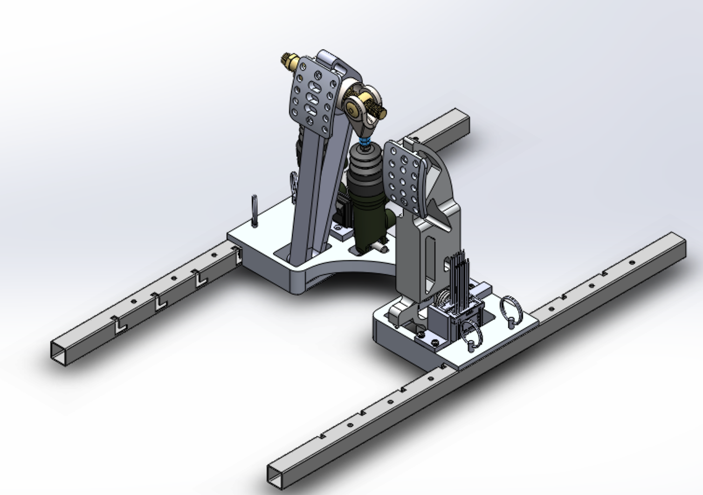

# Daniel Kıllıoğlu
_Junior Mechanical Engineering Student. All things engineering, design, and music. Based in Chicago and Istanbul 🇹🇷🇺🇸_  

[Email](mailto:danielklloglu@gmail.com) / [LinkedIn](https://www.linkedin.com/in/danielkillioglu/)

Hello! I am a third-year student pursuing an undergraduate Mechanical Engineering degree at Northwestern University's McCormick School of Engineering and Applied Science. I aim to combine my user-centered design and engineering knowledge to find practical and creative solutions with an aesthetic twist.

I take a special interest in the future of cars, music technology, and design. I always appreciate connecting with individuals who share my passion for design, tech, and vehicles. I am currently looking for internship opportunities that would help me cultivate and further hone skills in Automotive/Mechanical Engineering and challenge me intellectually.  

## 👨‍🎓 Education
**Northwestern University**, Evanston, IL	  _(Sep 2022 - June 2026 (anticipated))_  
Bachelor of Science in Mechanical Engineering	_GPA: 3.8/4_  
Robert R. McCormick School of Engineering and Applied Sciences

**Robert College**, Istanbul, TR _(Sep 2017 - June 2022)_
 

## ⚙️ Technical Skills
• *Computer-Based*: Siemens NX, SolidWorks, MATLAB, Python, Microsoft Office, Finite Element Analysis (FEA), 3DEXPERIENCE, Adobe Illustrator, Figma  
• *Manufacturing*: Computer-Aided Manufacturing (CAM), Laser Cutter, Prototyping, CNC, Molding, Injection Molding, Die Casting, Sheet Metal Forming  
• *Soft-Skills*: Work Ethic, Multicultural Communication, Adaptability, Effective Collaboration
 

## 💬 Languages

🇺🇸 **English**: Native  
🇹🇷 **Turkish**: Native  
🇩🇪 **German**: Limited Working Proficiency
 

## 🧑‍💻 Engineering Experience

**Truck R&D Engineer Intern** @ Mercedes-Benz Türk A.S. _(July 2024 - October 2024)_
• Investigated a user-interacting component by kinematic simulation in Siemens NX and optimized it for ergonomics,
cost, and injection molding
• Analyzed stress concentrations on connection points of a sheet metal component with Finite Elements Analysis and
developed a new concept, reducing stress concentrations by 40%
• Designed a self-activating flap system with die cast components to accommodate a new electric truck charging
feature, providing a low-cost alternative to a current solution
• Coordinated simulation, prototyping, testing, and manufacturing processes of three new concepts via engineering
drawings and GD&T  

**Chassis and Suspension Design Engineer** @ [Northwestern Formula Racing]((https://northwesternformularacing.com/)) _(Sep 2022 - Present)_  
Formula SAE team based in Northwestern University.
• Designed pedal box, wheel hubs, and steering rack to Formula SAE regulations and manufacturability constraints
• Implemented a new throttle return system consisting of torsional springs and rotational potentiometer for smoother throttle return and more precise throttle sensing
• Manufactured parts in-house using Mill, Lathe, and CNC
• Validated quality and function of final parts through throttle sensor analysis and field testing  

 

**Product Design Engineer** @ [Segal Design Institute DTC Program]((https://design.northwestern.edu/programs/take-design-course/design-thinking-communication/)) _(September 2022 - June 2023)_  
Worked on real design problems submitted by individuals, non-profits, entrepreneurs, and industry members.  
 
**Client**: Northwestern Formula Racing  
Product: [_The Ark_](./theark.md)  
  • Designed a durable, ergonomic, sustainable, and secure steering rack cover for a Formula SAE car
  • Improved driver safety and leg space while preserving ideal leg position for acceleration and braking  
  

 

**Client**: Trees That Feed Foundation  
Product: [_Aeroflect_](./aeroflect.md)  
  - Led a four-member team
  - Improved the drying time of a Hybrid Solar Dryer used in fruit farms in over 20 countries
  - Achieved more uniform drying
 

## 📊 Projects

**Head Content Manager and Outreach Coordinator** @ [The Loop Network](https://www.linkedin.com/company/the-loop-net-work/) [Instagram](https://www.instagram.com/thealtrockloop/?hl=en/)  
_(September 2020 - October 2022)_  
  - An entertainment media network focused on arts & music.
  - Co-built an entertainment media network focused on arts & music
  - Managed a team of content creators and writers to create engaging and effective content
  - Experimented with monetization strategies and ways of reaching new audiences/customers
  - Used Adobe Illustrator, Photoshop, and Figma to create content
  - Increased audience reach by 250%  

**Radio Host** @ [89.3 WNUR-FM](https://wnur.northwestern.edu/)  
_(September 2022 - Present)_  
  - Directed weekly rock radio shows
  - Gave exposure to underground artists of the greater Chicago area

